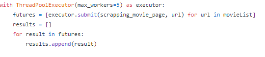

# Processos, threads e escalonamento
 * Processadores de contexto múltiplo fornecem conjuntos de registros múltiplos para multiplexar vários threads em um pipeline de processador, a fim de tolerar essas latentes de comunicação e sincronização. Vários conjuntos de registros, incluindo vários ponteiros de instrução, permitem que o estado de vários threads sejam carregados e prontos para serem executados ao mesmo tempo. [Fiske, 1995]
## Processos
* Um processo é basicamente um programa em execução. Associado a cada processo está o seu espaço de endereçamento e uma lista de posições de memória que este processo pode ler e escrever. [Faria, 2013]

## Threads
* Uma execução de instruções que pode ser executado em paralelo em vários processos ou concorrente atraves de um processo.
* Existe dois tipos distintas de Threads:
    * User-level = Podemos utilizar no código (essa que usamos para fazer esse projeto) 
    * Kernel-level = Threads que são low-level e são diretamente ligadas aos processos do sistema operacional.
## Escalonamento de processos
* Atividade responsável pela alocação dos processos aos processadores.[Maciel, 2013]

## Porque usamos Multithreads ao inves do Multiprocessors?
Para o projeto verificamos que cada genero escolhido pelo usuário tem pelo menos 1000 filmes. Executando esse programa de forma linear demoraria horas para finalizar a execução. Porque utilizamos Multithreads? Pois, multiprocessadores está totalmente relacionado aos cores da máquina e os múltiplos processos do Python tem muito overhead.
Então utilizamos Multithreaded Web Scraping, pois pode executar tasks concorrentes através de múltiplas threads no mesmo processo, e essas tasks podem ser executadas enquanto o Python está sendo executado, e essas threadssão executadas asíncronamente.

No código definimos que o códio iria rodar com 5 threads, definido pelo max_workers.

